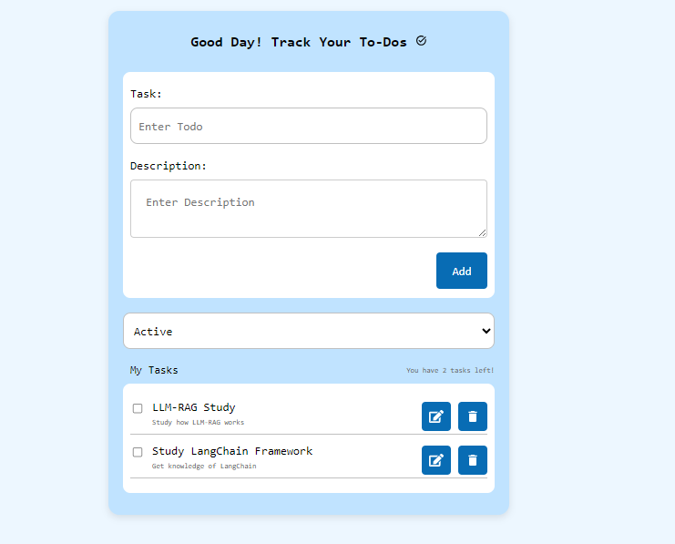

# Full Stack React-Django ToDo Application
This project is a full-stack application built with Django (backend) and React (frontend). The backend provides a REST API, while the frontend offers an intuitive user interface for managing tasks.

### Backend Setup
1. Navigate to the `backend` directory:
   cd react-django-todo/backend
2. Create a virtual environment and actiate it
   python -m venv venv
   source venv/bin/activate   # On Windows: venv\Scripts\activate
3. pip install -r requirements.txt
4. Apply migrations:
   python manage.py migrate
5. Run the server
   python manage.py runserver

### Frontend Setup
1. Navigate to the vite-frontend directory:
   cd react-django-todo/vite-frontend
2. Install dependencies
   npm install
3. Run the development server
   npm run dev
4. Access frontend at: http://localhost:5173 

### How to Run
1. Start the Django backend server:
   python manage.py runserver
2. Start the React frontend development server:
   npm run dev
4. Open your browser and navigate to frontend url: http://localhost:5173

Project Root directory
--------------------------
react-django-todo/ ├── backend/ # Django backend (REST API) ├── vite-frontend/ # React frontend ├── README.md # Project overview and documentation

Django Backend File Structure
--------------------------------
backend/ ├── manage.py # Django's command-line utility ├── db.sqlite3 # SQLite database file ├── requirements.txt # Backend dependencies ├── backend/ # Project settings and configuration │ ├── init.py │ ├── asgi.py │ ├── settings.py # Django project settings │ ├── urls.py # Root URL configuration │ ├── wsgi.py ├── todos/ # Main app for managing todos │ ├── init.py │ ├── admin.py # Admin site configuration │ ├── apps.py # App configuration │ ├── migrations/ # Database migrations │ │ ├── init.py │ │ └── ... (migration files) │ ├── models.py # Database models │ ├── serializers.py # Django REST framework serializers │ ├── tests.py # Unit tests │ ├── urls.py # App-specific URLs │ ├── views.py # API views

React Frontend File Structure
--------------------------------
vite-frontend/ ├── public/ # Static files │ └── vite.svg ├── src/ # Application source code │ ├── components/ # React components │ │ ├── TodoAdd.jsx # Component for adding todos │ │ ├── TodoFilter.jsx # Component for filtering todos │ │ └── TodoHeader.jsx # Header component │ │ └── TodoList.jsx # Component for displaying todos │ ├── App.css # Global styles │ ├── App.jsx # Main App component │ ├── index.css # Styles for index │ ├── main.jsx # Application entry point ├── eslint.config.js # ESLint configuration ├── package-lock.json # Package dependencies lock file ├── package.json # Project metadata and dependencies ├── index.html # Main HTML file ├── vite.config.js # Vite configuration

#### Preview

